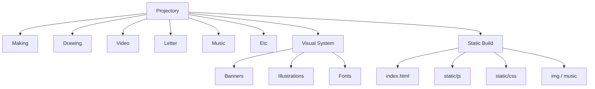

# Projectory

> A laboratory for the next generation.  
> A participatory web experience where children can make, draw, choose, and leave something behind.

Korean version: [README.md](./README.md)

`Projectory` is not a showcase site. It is a web-based experiment space where children can make, draw, choose, and leave something behind.  
In 2020, I cared less about flashy UI and more about designing an experience that invited participation.

My motivation was simple: learning should not feel like reading an answer sheet. It should feel like touching, choosing, and making something yourself.  
So this project was designed around participation rather than explanation. Users should enter, choose, react, and leave a trace.

For me, Projectory became the first large experiment that showed how design can shape participation rather than only presentation.

## Why I Built This

- I wanted to change the learning experience from passive reading to active participation.
- I wanted to validate an interaction flow that works for children.
- I wanted to build a web experience where the user leaves a trace, not just views a page.

## How I See My 2020 Self

In 2020, I was good at turning abstract ideas into scenes and quickly shaping flow with banners, choices, and transitions.

My gaps were also clear:

- I was less disciplined about separating code from content into reusable structures.
- I did not think as rigorously about maintainability and extensibility as I do now.
- I focused more on making something feel complete than on systemizing it.

## Why It Still Matters

Projectory changed how I think about design.  
After this project, I stopped seeing design as presentation and started seeing it as participation.

That mindset carried into later UX, interactive, AI, and systems work:

- UX: I started paying more attention to first-impression flow.
- Interactive work: I started designing feedback and rhythm more intentionally.
- AI and systems work: I started looking first for the user's real bottleneck.

## What Is Inside

- Making
- Drawing
- Video
- Letter
- Music
- Etc

## Tech Stack

- React
- Create React App
- CSS, image assets, audio assets, static banner content
- Reactstrap / Bootstrap-based components
- Google Fonts: `Noto Sans KR`, `Nanum Pen Script`, `Poor Story`

## IA

Useful Obsidian companion: [`IA.canvas`](./IA.canvas)

---

Built as a child-friendly experimental lab.
