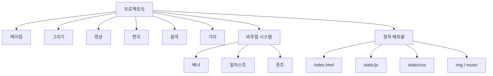

# 프로젝토리

> 미래 세대를 위한 실험실.  
> 아이들이 직접 만들고, 그리고, 고르고, 남기는 참여형 웹 경험.

[사이트 보기](https://dosigner.github.io/ncfound/) · [English version](./README.en.md)

`프로젝토리`는 결과물을 전시하는 사이트가 아니라, 아이들이 직접 만들고, 그리고, 고르고, 남길 수 있는 실험 공간을 웹으로 옮긴 프로젝트입니다.  
2020년의 나는 이 프로젝트를 만들면서 "멋진 화면"보다 "참여가 자연스럽게 일어나는 흐름"이 더 중요하다고 봤습니다.

당시의 문제의식은 단순했습니다. 아이들이 무언가를 배울 때 필요한 것은 정답을 먼저 보여주는 UI가 아니라, 자기 손으로 만져보고 선택해보는 경험이라고 봤습니다.  
그래서 이 프로젝트는 설명 중심이 아니라 참여 중심으로 설계됐습니다. 사용자가 보기만 하는 화면이 아니라, 들어오고, 고르고, 반응하고, 흔적을 남기는 구조가 필요했습니다.

프로젝토리는 그 생각을 가장 직접적으로 실험한 기록입니다.  
나에게 이 프로젝트는 "귀여운 디자인"을 만든 일이 아니라, 디자인이 참여를 어떻게 설계할 수 있는지 확인한 첫 번째 큰 실험에 가깝습니다.

> [!note]
> 이 저장소는 개발 소스 전체보다 **배포 결과물과 아카이브 성격**이 강합니다.
> 현재 남아 있는 코드는 `index.html`, `static/js`, `static/css`, `img`, `music` 중심의 정적 산출물입니다.

## 왜 만들었는가

이 프로젝트를 만든 이유는 분명했습니다. 아이들을 위한 서비스에서 중요한 것은 예쁜 화면이 아니라, 스스로 들어오고 머무르고 다시 시도하게 만드는 흐름이라고 판단했습니다.

- **배우는 경험을 바꾸고 싶었다**: 정답을 보는 경험보다, 직접 손을 움직이고 반응을 얻는 경험이 더 오래 남는다고 봤습니다.
- **아동 친화적 흐름을 검증하고 싶었다**: 아이들을 위한 서비스는 예쁜 그림만으로는 부족하고, 흐름이 명확해야 했습니다.
- **참여형 웹을 만들고 싶었다**: 보여주는 사이트보다, 사용자가 자기 흔적을 남기는 사이트를 만들고 싶었습니다.

## 2020년의 나를 어떻게 보는가

2020년의 나는 감각적으로 빠르게 구조를 잡는 데 강했습니다.  
추상적인 아이디어를 장면으로 바꾸고, 배너와 선택지와 전환을 통해 흐름을 만들고, 사용자가 무엇을 먼저 봐야 하는지 빠르게 결정할 수 있었습니다.

그 대신 부족한 점도 분명했습니다.

- 코드와 콘텐츠를 분리해 재사용 가능한 구조로 정리하는 습관은 지금보다 약했습니다.
- 유지보수와 확장성을 지금만큼 엄격하게 보지 못했습니다.
- 완성도를 보여주는 데 집중한 나머지, 시스템화는 상대적으로 덜 신경 썼습니다.

이 기록을 남기는 이유는, 그때의 약함을 숨기기 위해서가 아닙니다.  
오히려 그 시기의 강점과 약점을 같이 적어야 이 프로젝트가 왜 의미가 있는지 더 정확하게 보이기 때문입니다.

## 이 프로젝트의 의미

`프로젝토리`는 내가 디자인을 보는 방식을 바꿔놓은 프로젝트입니다.  
그 전까지는 디자인을 "보여주는 것"에 더 가깝게 생각했다면, 이 프로젝트 이후에는 디자인을 "참여를 설계하는 것"으로 보기 시작했습니다.

그 관점은 이후의 작업으로 이어졌습니다.

- UX에서는 사용자가 처음 들어왔을 때 어떤 감각을 받는지 보게 됐습니다.
- 인터랙티브 작업에서는 반응과 리듬을 설계하게 됐습니다.
- AI와 시스템 작업에서는 사용자가 무엇을 하고 싶은지, 어떤 병목을 실제로 겪는지 먼저 보게 됐습니다.

## 무엇이 들어 있나

사이트 구조는 아이들이 소비자가 아니라 참여자가 되도록 설계돼 있습니다.

- **메이킹**: 손으로 만드는 감각을 중심에 둔 활동 섹션
- **그리기**: 그림과 캐릭터, 색감 중심의 탐색 섹션
- **영상**: 움직임과 짧은 서사를 보여주는 영상 섹션
- **편지**: 메시지와 감정을 남기는 텍스트 중심 섹션
- **음악**: 소리와 분위기를 체험하는 섹션
- **기타**: 위 분류에 들어가지 않는 실험적 콘텐츠 영역

## 기술 스택

- **Application shape**: React 기반 단일 페이지 웹 앱
- **Build artifact**: Create React App 계열 정적 번들 `index.html`, `static/js`, `static/css`
- **Deployment path**: GitHub Pages 서브패스 `/ncfound/`
- **UI layer**: Bootstrap / Reactstrap 계열 컴포넌트 흔적이 남아 있는 구조
- **Assets**: 로컬 이미지 아카이브, 배너 이미지, 오디오 파일
- **Typography**: Google Fonts `Noto Sans KR`, `Nanum Pen Script`, `Poor Story`

## 코드베이스에서 보이는 것

- 원본 개발 소스는 현재 저장소에 남아 있지 않고, 배포 결과물이 중심입니다.
- `index.html`과 번들된 CSS/JS를 기준으로 보면 React 앱을 빌드해 정적으로 배포한 형태입니다.
- `img`, `music` 디렉토리는 이 프로젝트가 기능보다도 분위기와 참여 감각을 강하게 설계했다는 흔적을 보여줍니다.

## IA

Obsidian에서 함께 보면 좋은 버전: [`IA.canvas`](./IA.canvas)

## 한 줄 요약

프로젝토리는 내가 "디자인은 보여주는 것이 아니라 참여를 설계하는 일"이라고 확실히 생각하게 만든 첫 번째 프로젝트입니다.

---

아이들이 직접 들어와 보고, 고르고, 남길 수 있도록 만든 참여형 실험실입니다.
