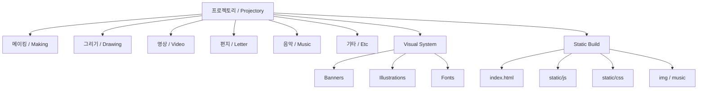

# 프로젝토리 / Projectory

> 미래 세대를 위한 실험실.  
> A laboratory for the next generation.

`프로젝토리`는 결과물을 전시하는 사이트가 아니라, 아이들이 직접 만들고, 그리고, 고르고, 남길 수 있는 실험 공간을 웹으로 옮긴 프로젝트입니다.  
2020년의 나는 이 프로젝트를 통해 "보여주는 UI"보다 "참여를 설계하는 경험"이 더 중요하다고 생각했습니다.

`Projectory` is not a showcase site. It is a web-based experiment space where children can make, draw, choose, and leave something behind.  
In 2020, I cared less about flashy UI and more about designing an experience that invited participation.

## Why I Built This / 왜 만들었는가

- **한국어**: 배우는 경험은 정답을 보는 순간보다, 스스로 손을 움직여보는 순간에 더 오래 남는다고 봤습니다.
- **English**: I believed learning lasts longer when people touch, choose, and make things themselves instead of only seeing the answer.
- **한국어**: 아이들을 위한 서비스는 귀여운 비주얼만으로는 부족하고, 흐름이 명확하고 즉시 반응하는 상호작용이 필요했습니다.
- **English**: A kids-oriented service needs more than cute visuals. It needs a clear flow and immediate feedback.
- **한국어**: 2020년의 나는 시각적 구조화와 프로토타입 제작에는 강했지만, 재사용 가능한 시스템으로 정리하는 습관은 지금보다 약했습니다.
- **English**: In 2020, I was strong at visual structuring and prototyping, but less disciplined about reusable system design than I am now.

## What It Means / 이 프로젝트의 의미

이 프로젝트는 "보여주는 웹"보다 "참여하게 만드는 웹"에 가깝습니다.  
사용자는 단순한 관람자가 아니라, 여러 활동 안으로 들어와 자기 흔적을 남기는 참여자가 됩니다.

This project is closer to a web experience that invites participation than a site that only displays content.  
The user is not just a viewer. They become a participant who leaves traces through making, drawing, video, letters, and music.

## What Is Inside / 무엇이 들어 있나

- **메이킹 / Making**: 손으로 만드는 감각을 중심에 둔 활동 섹션
- **그리기 / Drawing**: 그림과 캐릭터, 색감 중심의 탐색 섹션
- **영상 / Video**: 움직임과 짧은 서사를 보여주는 영상 섹션
- **편지 / Letter**: 메시지와 감정을 남기는 텍스트 중심 섹션
- **음악 / Music**: 소리와 분위기를 체험하는 섹션
- **기타 / Etc**: 위 분류에 들어가지 않는 실험적 콘텐츠 영역

## 2020 Perspective / 2020년의 나를 어떻게 보는가

### Strengths / 강점

- **한국어**: 추상적인 주제를 빠르게 장면으로 바꾸는 감각이 있었습니다.
- **English**: I was good at turning abstract ideas into scenes.
- **한국어**: 페이지마다 배너, 선택, 전환이 분명하게 느껴지도록 흐름 중심으로 설계하려고 했습니다.
- **English**: I preferred designing flow and feedback over static explanation.

### Weaknesses / 한계

- **한국어**: 감각적으로 만드는 데는 강했지만, 코드와 콘텐츠를 분리해 재사용 가능한 구조로 정리하는 습관은 부족했습니다.
- **English**: I could build things intuitively, but I was less disciplined about separating code from content and making the structure reusable.
- **한국어**: 기능 확장성과 유지보수 관점에서는 지금보다 덜 엄격했습니다.
- **English**: I was less strict than I am now about extensibility and maintainability.

### Why It Still Matters / 지금도 의미가 있는 이유

프로젝토리는 내가 "디자인은 보여주는 것이 아니라 참여를 설계하는 일"이라고 생각하게 만든 프로젝트입니다.  
그 관점은 이후의 UX, 인터랙티브, AI, 시스템 작업으로 계속 이어졌습니다.

`Projectory` shaped the way I think about design: not as display, but as participation.  
That idea continued into my later UX, interactive, AI, and systems work.

## Tech Stack / 기술 스택

- **Framework**: React
- **Build**: Create React App
- **Styling and media**: CSS, image assets, audio assets, static banner content
- **UI library**: Reactstrap / Bootstrap-based components
- **Typography**: Google Fonts (`Noto Sans KR`, `Nanum Pen Script`, `Poor Story`)

## IA / Information Architecture

Obsidian용 캔버스 버전도 함께 두었습니다: [`IA.canvas`](./IA.canvas)

## Notes / 확인 메모

- 이 저장소는 소스 전체가 아니라 정적 산출물 중심의 스냅샷입니다.
- 원래 앱은 React 기반으로 제작되었고, 현재 폴더에는 배포 결과물이 남아 있습니다.
- GitHub에서는 위 Mermaid IA가 바로 보이고, Obsidian에서는 `IA.canvas`를 함께 열어볼 수 있습니다.

---

Built as a child-friendly experimental lab.  
아이들이 직접 참여할 수 있는 실험실로 만들었습니다.
