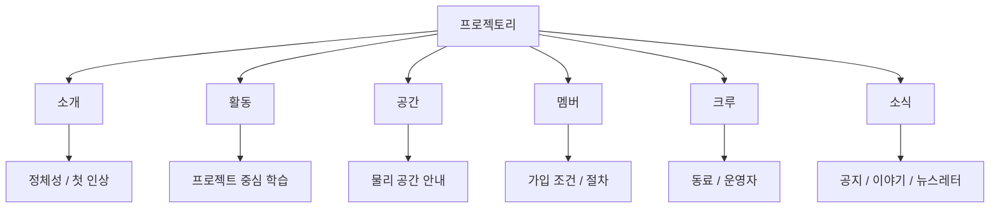

# 프로젝토리 사이트 분석

> [!summary]
> 이 사이트는 아이들을 위한 학습 공간을 "보여주는 웹"이 아니라 "참여하는 웹"으로 설명한다.  
> 핵심 키워드는 `자발성`, `수평성`, `기록`, `프로젝트`, `동료`다.

[[README|한국어 README]] · [[README.en|영문 README]] · [[IA.canvas|IA 캔버스]] · [라이브 사이트](https://dosigner.github.io/ncfound/)

> [!info]
> 이 노트는 두 가지를 함께 기준으로 삼는다.
> 1. 공개된 라이브 사이트의 정보 구조와 문구
> 2. 현재 저장소에 남아 있는 정적 배포 산출물

## 한 줄 정의

프로젝토리는 아이들이 스스로 프로젝트를 만들고, 시도하고, 기록하는 실험실형 커뮤니티 사이트다.

## 정보 구조

## 구조 분석

### 소개

홈은 기능보다 세계관을 먼저 설명한다.
메인 문구, 멤버들의 인용, 아이들이 어떤 경험을 했는지에 대한 짧은 장면이 먼저 나오고, 그 다음에 활동, 공간, 멤버, 크루로 이어진다.

### 활동

활동 페이지는 이 사이트의 핵심 주장이다.

> [!quote]
> 프로젝토리에서는 그 무엇이든 프로젝트가 될 수 있습니다.

이 문장은 사이트 전체를 관통한다.  
`기획 → 실행 → 기록`이라는 3단 구조와 함께, `선생님/시간표/숙제 없음`이라는 반대 정의를 통해 학습 공간의 성격을 분명하게 만든다.

### 공간

공간 페이지는 물리적 장소를 정보로 번역하는 방식이 좋다.  
`영감을 주는 공간`, `생각을 정리하는 공간`, `소리에 집중하는 공간`, `쉬는 공간`, `회의 공간`처럼 기능을 감정과 행동으로 동시에 설명한다.

### 멤버

멤버십 페이지는 자발성과 적합성을 기준으로 사용자를 선별한다.  
연령, 의지, 철학 공감이라는 조건이 있고, 가입 절차도 `회원가입 → 상담 → 방문 → 등록 → 활동 시작`으로 단계화되어 있다.

### 크루

크루 페이지는 이 사이트의 관계 철학을 가장 선명하게 보여준다.

> [!important]
> 선생님이 아닌, 크루가 존재합니다.

여기서 크루는 운영자가 아니라 동료에 가깝다.  
이 페이지는 `수평어`, `동등한 관계`, `과정 중심`, `안전한 실패`라는 가치로 사이트의 문화적 톤을 완성한다.

### 소식

소식은 공지와 이야기, 뉴스레터 유입을 담당하는 채널로 보인다.  
사용자에게는 메인 내러티브를 보완하는 보조 진입점 역할을 한다. 강한 정체성 문구를 반복해서 상기시키는 장치이기도 하다.

## 관찰 메모

- 이 사이트는 `무엇을 제공하는가`보다 `어떤 태도를 권하는가`를 먼저 말한다.
- 정보 구조는 단순하지만, 문구가 철학을 반복해서 밀어주는 방식이라 인상은 강하다.
- 기능 설명이 부족해서가 아니라, 의도적으로 기능보다 문화와 관계를 전면에 둔다.
- 그래서 잘 맞는 사용자에게는 강하게 설득되지만, 처음 보는 사용자에게는 다소 추상적으로 읽힐 수 있다.

## 문구 톤

### 현재 톤의 특징

- 선언형이다. 사이트의 가치관을 먼저 말한다.
- 관계 중심이다. 기능보다 사람과 태도를 먼저 설명한다.
- 반복이 많다. 같은 핵심을 여러 섹션에서 다른 표현으로 다시 말한다.
- 확신이 강하다. 흔들리는 표현이 적고, 신념이 분명하다.

### 자주 등장하는 키워드

- 프로젝트
- 동료
- 수평적 관계
- 자발성
- 기록
- 생각
- 경험
- 자유
- 성장

### 잘 작동하는 이유

- 아이들을 위한 공간이라는 점이 직접적으로 드러난다.
- "가르치는 곳"이 아니라 "함께 만드는 곳"이라는 차이가 분명하다.
- 사이트가 단순 홍보물처럼 보이지 않고, 철학이 있는 커뮤니티처럼 읽힌다.

### 더 다듬을 수 있는 부분

- 긴 문장이 많아 첫 화면에서 핵심이 늦게 보일 수 있다.
- 같은 의미의 문장을 여러 섹션에서 반복해서 읽는 피로감이 있다.
- 일부 표현은 추상적이라, 실제 활동 장면으로 한 번 더 내려주면 더 강해진다.

## 문구 리라이트 원칙

- 철학은 유지하되 첫 문장은 더 짧게 쓴다.
- 추상 명사는 한 번만 쓰고, 다음 문장에서는 행동 장면으로 내려준다.
- `가르친다`보다 `함께 만든다`, `지원한다`, `기록한다` 같은 동사를 우선한다.
- 어린 사용자보다 보호자나 외부 방문자가 읽었을 때도 맥락이 잡히도록 문장 첫머리의 정보 밀도를 높인다.

## 추천 카피 정리

### 메인 히어로

**현재 의도**  
미래 세대를 위한 실험실

**정리한 버전**  
아이들이 스스로 프로젝트를 만들고, 시도하고, 기록하는 실험실

### 활동 소개

**정리한 버전**  
프로젝토리에서는 무엇이든 프로젝트가 됩니다. 아이들은 자신이 하고 싶은 일을 스스로 정하고, 시도하고, 기록합니다.

### 공간 소개

**정리한 버전**  
궁금한 것을 찾아보고, 생각을 정리하고, 집중할 수 있는 공간입니다.

### 멤버십 소개

**정리한 버전**  
프로젝토리는 자발적으로 참여하고, 공간의 철학에 공감하는 10세~18세 멤버를 위한 커뮤니티입니다.

### 크루 소개

**정리한 버전**  
크루는 가르치는 사람이 아니라, 멤버가 자기 프로젝트를 끝까지 밀어붙일 수 있도록 옆에서 돕는 동료입니다.

## 핵심 메시지

> [!success]
> 이 사이트는 기능을 소개하는 페이지가 아니라, 아이들이 스스로 생각하고 행동하는 방식을 제안하는 페이지다.

## 저장소와의 연결

> [!example]
> 현재 저장소는 완전한 개발 소스 저장소라기보다 배포 결과물을 보존한 아카이브에 가깝다.
> 따라서 이 노트는 코드 구조 분석보다 `정보 구조`, `카피`, `배포 흔적` 해석에 더 초점을 둔다.

- `index.html`은 `/ncfound/` 서브패스 배포를 전제로 만들어져 있다.
- `static/js`, `static/css`는 React 기반 정적 번들의 흔적을 보여준다.
- `img`, `music` 디렉토리는 이 사이트가 시청각 경험을 중요하게 다뤘다는 근거다.

## 연결 메모

- [[README]]는 한국어 서사형 설명용
- [[README.en]]은 영문 병기용
- [[IA.canvas]]는 구조를 시각적으로 보는 용도
